<div align="center">




</div>

```text
 __  __ ___ ___ _____   ___     ___ _   _ _____ _  _   _   ___ 
|  \/  | __| __|_   _| / __|   / __| | | |_   _| || | /_\ | _ \
| |\/| | _|| _|  | |   \__ \_  \__ \ |_| | | | | __ |/ _ \|   /
|_|  |_|___|___| |_|   |___(_) |___/\___/  |_| |_||_/_/ \_\_|_\
```

<div align="center">


<a href="https://linkedin.com/in/meet32778"></a>
<a href="mailto:meetkumar.s.suthar@gmail.com"></a>
</div>

<br>

```bash
meet@fedora:~$ neofetch
```

```text
       .::.              meet@fedora
     .::::::.             ───────────────────────────
   .::::::::::.           OS       : Fedora Linux (daily driver)
  ::::::::::::::          Host     : B.Tech CS · Navrachana University
  ::::::::::::::          Session  : 2023 – 2027  ·  CGPA 8.08/10
   ::::::::::::           Role     : Aspiring DevOps / Cloud Engineer
     ':::::::'            Shell    : bash
       '::'               Learning : Linux · Docker · CI/CD · K8s · Cloud
                           Certs    : AWS Academy x2 · Intel Cloud DevOps
                           Contact  : meetkumar.s.suthar@gmail.com
                           Fun_fact : edits video on DaVinci Resolve, on Linux
```

---

```bash
meet@fedora:~$ cat about.md
```

> 🔭 Working through a structured **DevOps learning roadmap**
> 🌱 Currently learning: **Linux · Git · Docker · CI/CD · Cloud**
> 💬 Ask me about **Fedora/Arch Linux, shell scripting, open-source**
> 🔁 Transitioning from full-stack MERN dev into infrastructure & automation
> ⚡ Fun fact: I edit videos with DaVinci Resolve — natively on Fedora

---

```bash
meet@fedora:~$ tree ~/skills --tech-stack
```

```text
~/skills
├── os_and_shell/
│   ├── linux (fedora, arch)
│   ├── bash
│   └── git
├── containers/
│   ├── docker
│   └── kubernetes (learning)
├── cloud/
│   └── aws
├── automation/
│   ├── github-actions
│   └── terraform (learning)
└── languages/
    ├── python
    ├── javascript / typescript
    └── c++
```

<div align="center">

</div>

---

```bash
meet@fedora:~$ ./roadmap.sh --status
```

```text
[■■■■■■■■□□□□□□□□□□□□] Docker            in-progress
[■■■□□□□□□□□□□□□□□□□□] CI/CD             started
[□□□□□□□□□□□□□□□□□□□□] Kubernetes        queued
[□□□□□□□□□□□□□□□□□□□□] Terraform         queued
[□□□□□□□□□□□□□□□□□□□□] Ansible           queued
[□□□□□□□□□□□□□□□□□□□□] Prometheus/ArgoCD queued

4-month roadmap: Docker -> CI/CD -> Kubernetes -> Terraform -> Ansible -> Prometheus/ArgoCD
```

---

```bash
meet@fedora:~$ docker ps --filter "label=featured"
```

| CONTAINER      | PROJECT                     | STACK                              | STATUS                    |
|----------------|------------------------------|-------------------------------------|----------------------------|
| `fp-driver`    | [FocalTech Fingerprint Driver](https://github.com/Meetsuthar32778/2808-A658-fingerprint-arch-linux-driver) | Arch Linux · C · USB (2808:A658)   | 🟢 low-level Linux debugging |
| `career-ai`    | [AI Career Counsellor](https://github.com/Meetsuthar32778/Career_Counsellor) | MERN · AI · Docker/CI-CD (adding)  | 🟡 DevOps layer in progress  |

---

```bash
meet@fedora:~$ certly --list --verified
```

<div align="center">


</div>

---

```bash
meet@fedora:~$ curl -s https://api.github-stats/meetsuthar32778 | jq
```

<div align="center">

<!--  -->


<!--  -->


</div>

---

```bash
meet@fedora:~$ git log --graph --oneline --contributions
```

<div align="center">

<!--START_SECTION:snake-->

<!--END_SECTION:snake-->

</div>

---

```bash
meet@fedora:~$ cat contact.json
```

```json
{
  "linkedin": "linkedin.com/in/meet32778",
  "email": "meetkumar.s.suthar@gmail.com",
  "github": "github.com/Meetsuthar32778",
  "status": "open_to_internships"
}
```

<div align="center">
<sub>meet@fedora:~$ <span>█</span></sub>
</div>

<div align="center">

</div>
